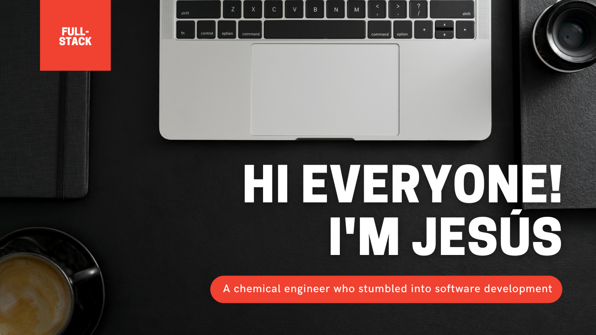
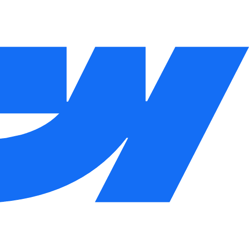
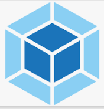
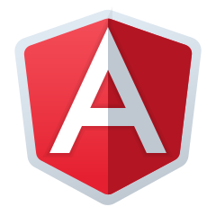
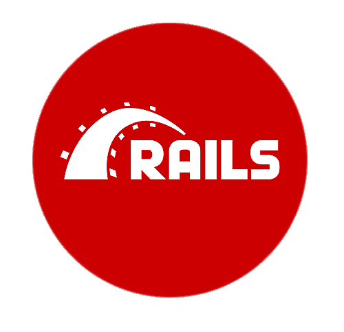

## 🧔 About me
> I'm a web developer and **Shopify** expert ready to help your business grow 🚀

Here's a description list of my experience and knowledge:

- I'm a chemical engineer by training with a master's in renewable energy 👷🏻
- For my thesis, I built some CO2 flux models with R studio. And that's when I fell in love with coding 📙
- With 3 years of experience, I'm fully dedicated to creating stunning **websites** and **Shopify** stores 👨🏻‍💻 
- Technologies: HTML  | CSS  | JavaScript  | Shopify  | Webflow  | Node.js  | Webpack  | Git  | GitHub  | Bootstrap  | React  | Angular  | Redux  | Ruby  | Ruby on Rails  | PostgreSQL 
- Interests: Programming 💻 | Tennis 🎾 | Reading 📕 | Seafood 🦐 | Learning 🤓

## 📊 Stats

## 📭 Contact
<code></code>
<code></code>
<code></code>
<code></code>

<!--
**jevazquezb/jevazquezb** is a ✨ _special_ ✨ repository because its `README.md` (this file) appears on your GitHub profile.

Here are some ideas to get you started:

- 🔭 I’m currently working on ...
- 🌱 I’m currently learning ...
- 👯 I’m looking to collaborate on ...
- 🤔 I’m looking for help with ...
- 💬 Ask me about ...
- 📫 How to reach me: ...
- 😄 Pronouns: ...
- ⚡ Fun fact: ...

I like learning and experimenting with new technologies, building projects and assisting to programming events.
-->
